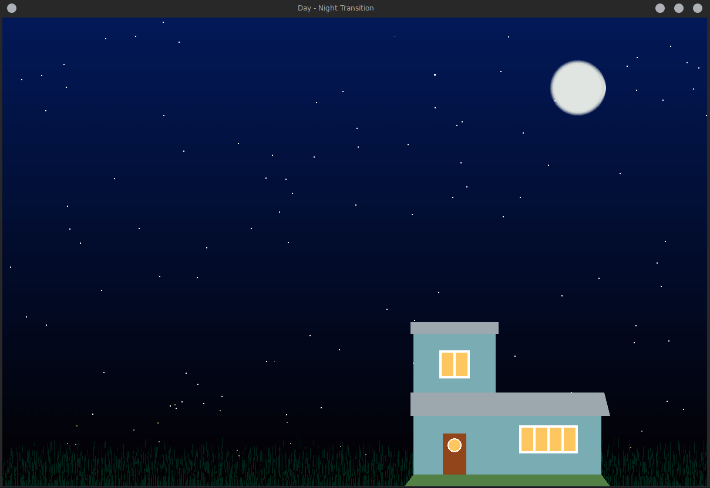

# DayNight-PyOpenGL
Day - Night transistion: Computer Graphics Mini Project using PyOpenGL

## Working
To run the code "python main.py"

## Config
To change the positions, sizes and colors of objects, edit the config.py file.

## Demo

## Elements
The graphics rendered consists of
1. Sky
2. Sun
3. Moon
4. Stars
5. Fireflies
6. Grass
7. House
